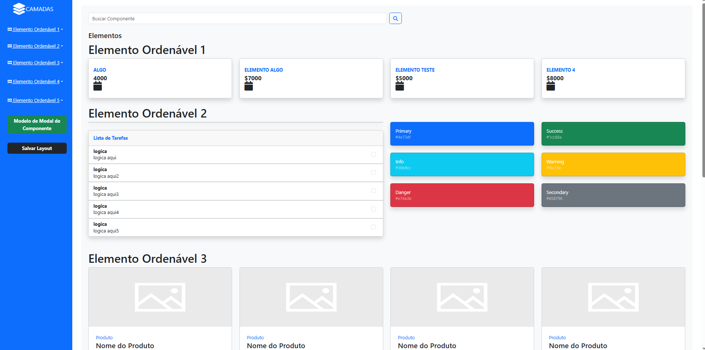
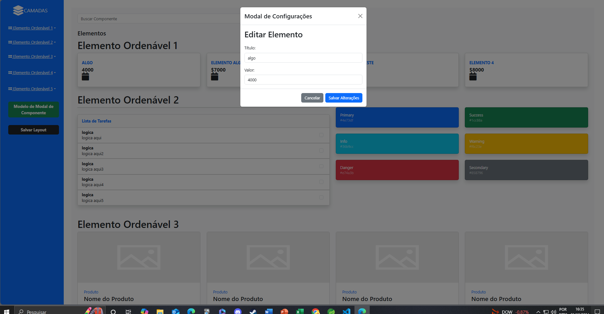
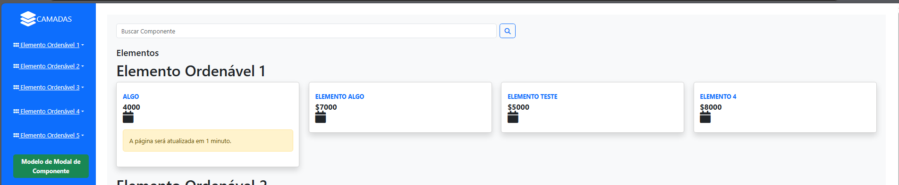
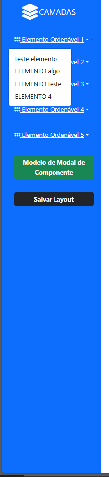

## Description
Projeto FrontEnd

### 📋 Pré-requisitos para executar o projeto
* nodejs
* vite
*  axios
* react
* fortawesome/fontawesome-free
*   "bootstrap": "^5.3.3"
*  "react-beautiful-dnd": "^13.1.1"
* "react-bootstrap": "^2.10.5",
* "react-dnd": "^16.0.1",
* "react-dnd-html5-backend": "^16.0.1",
*Typescript

## funcionalidade do projeto 
```
 editar campos da aplicação do calendário e esperar a requisição e ordenar a lista 

```
## depois de clonar o projeto usar as funcionalidades abaixo

```bash
vai na  pasta do vite-project é usar : 

$  npm install

```

* vai no data e usar npm install também para baixar o banco de dados e o server e depois só executar ele com : 
```bash
$ npm run start
```

* para executar o projeto na pasta vite-project
```bash
$  npm run dev
```


## executar primeiro o data para aparecer os dados antes e renderizar na tela , depois executar o vite-project que vai estar o front-end




## assim que ficou o projeto 




## ao clicar no calendário , vai abrir um modal de edição 




## depois de salvar o queria alterar , vai aparecer uma mensagem no card que editou dizendo que a página vai renderizar 




## no aside vai mostrar os elementos que foram editados na main ou nos campos que estão no elemendo ordenável 1


